# Deciphering WhatsApp Web

### CSEC380 - Computer Security Blogpost - Mehul Sen

## Introduction

WhatsApp is a free messaging and voice-over-IP service available on multiple platforms. It is owned by Facebook, Inc. and enables users to send text and voice messages, make voice and video calls, as well as share images, documents, user locations, and other content[[1]](#1).

One of its notable features is known as WhatsApp Web[[2]](#2), which allows users to access the messaging service on desktop computers as long as their mobile device remains connected to the internet. This capability was introduced in 2017 and it syncs the phone application with the desktop app, using the same WhatsApp account, thus retrieving all the messages and media. Unlike the mobile application, WhatsApp Web works on web browsers, which allows for further investigation into its infrastructure to better understand its behavior.

## Setup

As part of my research, I used an Ubuntu machine to log my SSL handshakes. The machine had a Firefox web browser and Wireshark installed, along with a stable internet connection and a working WhatsApp account. 

Since WhatsApp, like most messaging platforms, uses SSL to encrypt their traffic, I first needed to find a way to bypass the SSL encryption. 

To confirm this, I took a small Wireshark capture while using WhatsApp web and observed that all the traffic going to the WhatsApp server from the web browser was indeed encrypted using TLS. I was also able to see the TLS Client Hello and the change Cipher protocols in the Wireshark capture.

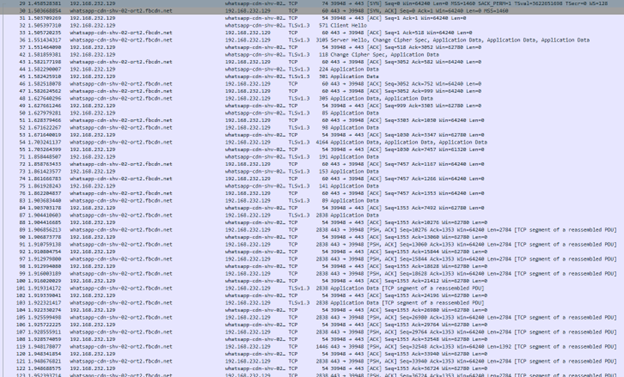

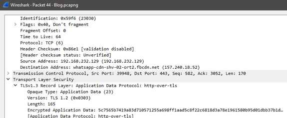

A bit of digging around provided me with an article on the AskF5 forum[2]. To get a better explanation of this method, I would suggest going over the link itself however the basic steps to go decipher the TLS packets are as follows:

- Create a Log file to store all the TLS handshakes.

  `$ touch sslkey.log`

- Modify the SSLKEYLOGFILE environment variable to store the handshakes within that log file.

  `$ export SSLKEYLOGFILE="/home/user/sslkey.log"`

- Open Firefox within the same shell

  `$ firefox &"`

  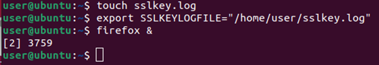

After using WhatsApp web using this web browser and capturing all this traffic through Wireshark we now have everything we need to see what is within the TLS packets.

This is what the generated sslkey.log file looks like once it had logged all the handshakes.

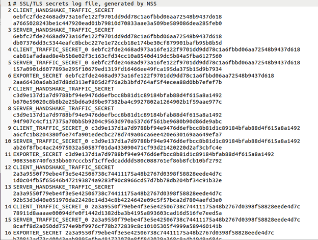

Wireshark has a built-in capability to read these logs and decrypt the .pcap traffic. This option is available under Edit > Preferences > Protocols > TLS > (Pre)-Master-Secret Log, selecting the generated sslkey.log, we are now able to look within all the encrypted TLS traffic.

By doing this, we are immediately able to see all the TLS traffic between the WhatsApp server and our web browser.

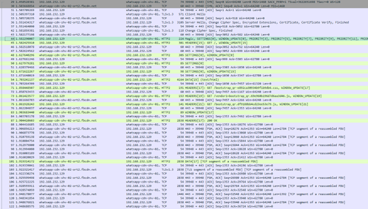

We can now go further and analyze these packets to get a better clue of how WhatsApp works.

## Analysis

After the TLS handshakes and the TCP connections, the first observation is that WhatsApp uses HTTP2 for most of its communication, the first packet sends out a Stream consisting of a couple of different headers.

These are `MAGIC`, `SETTINGS`, `WINDOW_UPDATE`, and `PRIORITY`.

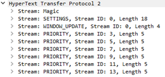

`MAGIC` – This contains the protocol and basic information about how data is being sent.

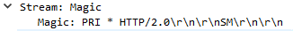

`SETTINGS` – Looking at the parameters which are Header Table Size, Initial Window Size, and Max Frame Size, This header would be used to set the initial browser window size, optimizing itself for the max size of frames it should receive based on the connection.

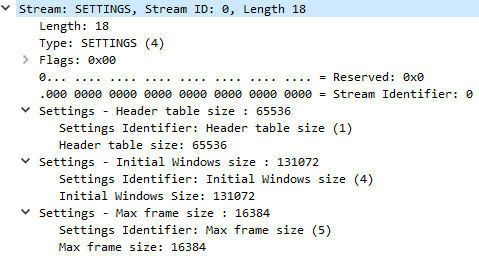

`WINDOW_UPDATE` – This header might provide any changes made to the window itself, updating the server using a parameter called “Window Size Increment”.

`PRIORITY` – This header contains five parameters, Reserved, Stream Identifier, Exclusive, and Stream Dependency and Weight. Looking at multiple PRIORITY headers, we learn that the Stream Identifier is the ID pertaining to the Data that gets sent at a later stage, The Stream Dependency is the number on which that PRIORITY header is dependent on and it is always a value lower than its own Stream ID. The Weight ranges from 0 to 240, and this might signify how important any particular Stream ID is.

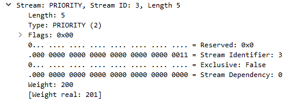

Although we can see `HEADERS` and `WINDOW_UPDATE` as well as `SETTINGS` throughout the packet capture, the `MAGIC` and `PRIORITY` headers are not sent again which might mean that they are used for only the initial setup for WhatsApp Web.

After the initial packet, the next packet contains a new header called `HEADERS`. This contains information like the method used, the path, the authority, scheme, user-agent, data accepted, the language accepted, encoding accepted, upgrade-insecure-requests, and the trailers.

The next couple of `HEADERS` send `GET` requests to “`/bootstrap_qr-e892ca30934b9f1b9db6.css`” for CSS, and “`/vendor1~bootstrap_qr.69e960b196d7d6aa3d46.js`”, “`/bootstrap_qr.df9188bb4cd23ee53e79.js`” for JavaScript.

As a reply, the server sends back a packet containing a `DATA` header. The first couple of `DATA` headers contain HTML, CSS and JavaScript requested by the Web Browser.

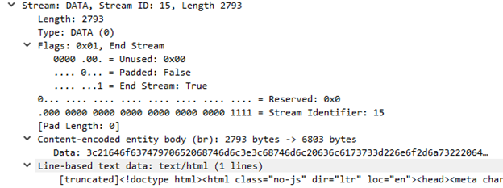

The `DATA` header is much simpler than its counterparts, it has a Stream Identifier parameter and a Data parameter that contain that data. It also has flags like Unused, Padded, and End-Stream. Padded is set to 1 when data is being sent, after the data has been completed, it gets set to 0 and the End Stream Flag is set to 1.

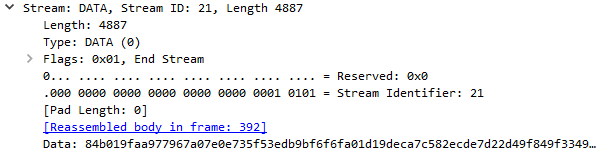

Observing all this data, we can see that it is all encrypted as well, this would be because of the implemented end-to-end encryption by WhatsApp, where each chat is individually encrypted among the recipients. WhatsApp provides its white pages which have a good explanation of how its Encryption and various features work[[3]](#3).

Although the chat itself is encrypted, we are still able to catch some data types that come from the server. One example of this is when a picture is shared, we can get the PNG signature, the image header, palette, image data chunk, and the image trailer.

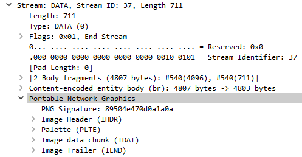

The emojis shared can also be seen when the web browser uses a `HEADERS` header to send a `GET` request for those resources, which goes as follows `GET /img/[emoji-name].webp`

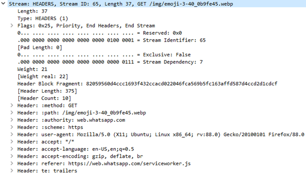

Another interesting header that occasionally comes up is the `RST_STREAM` header which contains a Stream Identifier parameter and an Error parameter.

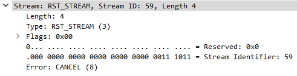

This is being used by the web browser to tell the server to stop processing certain streams or convey any other such errors.

The last header that gets sent to close the connections is the `GOAWAY` header, this is first sent by the web browser to the server and then the server echoes it back to the web browser, this contains a Stream Identifier, a reserved parameter, a Promised-Stream-ID parameter, and an Error parameter. A Successful closing takes place with the Error parameter set to 0 which is the `NO_ERROR` condition.

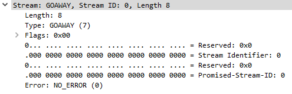

## Future Research Possibilities

Further research can be conducted on the protocol, traffic can be captured while performing various actions such as sending different media through chat, adding new users, deleting messages, creating group chats, etc. This will provide us with an even clearer understanding of the headers and protocols used by WhatsApp. We can even use the technical white pages[[4]](#4) provided by WhatsApp to further decrypt the end-to-end encrypted data, finding out exactly how each text message is sent.

## Conclusion

WhatsApp Messenger is a very sophisticated environment with its own set of protocols and headers, WhatsApp Web allows us to monitor this traffic through HTTP and get a better understanding of how it behaves. We can bypass the SSL encryption and get a clearer view of the interactions taking place between WhatsApp servers and the Web browser.

## Disclaimer

Since WhatsApp web is a private organization, it does not disclose its exact source code. We cannot know exactly how it behaves in the backend, the most we can do is observe the traffic and make educated guesses on how it might work. I analyzed the web traffic captured and tried making the best estimates as to how I believe these headers might be used. This information may not be completely accurate.

## References

<a id="1">[1]</a> https://en.wikipedia.org/wiki/WhatsApp

<a id="1">[2]</a> https://web.whatsapp.com/

<a id="1">[3]</a> https://support.f5.com/csp/article/K50557518

<a id="1">[4]</a> https://scontent.whatsapp.net/v/t39.8562-34/122249142_469857720642275_2152527586907531259_n.pdf/WA_Security_WhitePaper.pdf?ccb=1-3&_nc_sid=2fbf2a&_nc_ohc=Uz1ThVZZLqUAX_10j-p&_nc_ht=scontent.whatsapp.net&oh=29e00608fc684abe813d602a491f5757&oe=60B54C19